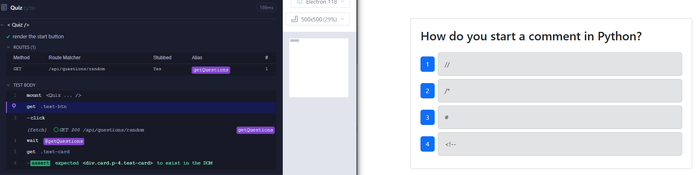

# Quiz Tech Application 👨‍💻
## Description
The Quiz Tech application is a fully functional MERN-stack quiz app that allows users to test their knowledge in technology-related topics. It fetches random questions and displays them in an interactive UI, and tracks the users progress.

 The goal of this project is to enhance the existing quiz app by implementing Cypress tests for both component and end-to-end testing.

 Click on the [video-walkthrough](img/Quiz-Tech.mp4) for demonstrations.
## Table of Contents

- [Installation](#installation)
- [Usage](#usage)
- [Features](#features)
- [Contribute](#contribute)
- [License](#license)

## Installation
For installations follow these simple steps:

1) Clone the repository to your local maching with git clone.

2) Install the dependencies using `npm install`.

3) Set up the environment variables by creating a `.env` file in your server directory:
```sh
MONGODB_URI='your_mongodb_connection_string'
```
(Note: Their is an example already set for you! All you need to do is remove ".EXAMPLE" and should be all set.)

4) On the main root directory, Build the application using `npm run build`.

5) Seed the database using `npm run seed` on the root directory.

6) Run the application using `npm run start:dev`.

7) To run the Cypress tests open a separate termainal and run `npx cypress open`.

Everything should look like the following image below:

## Usage

To interact with the Quiz Tech application:

- On the main directory run `npm run start:dev`.
- On the homepage click on the "Start Quiz" button to begin the quiz sessions.
- Answer some questions & click "Next" to continue the next session.
- At the end of the session the application will display your score.
- To make sure the app's functionality is correct, you can run the cypress tests by opening a separate terminal and run the Two following:
```sh
npm run start
```
```sh
npx cypress open
```
## Features

✅ Take a quiz with 10 random tech-related questions

✅ View the final score after completing the quiz

✅ Start a new quiz after finishing

✅ End-to-end tests to ensure smooth user interaction

✅ Fully tested using Cypress (Component & e2e Testing)

✅ Interactive UI with multiple-choice answers

## Contribute 

🚀 Developed by [stephanuh](https://github.com/stephanuh/Book-Search)

## 📜License
This application is covered under [](https://opensource.org/licenses/MIT)
